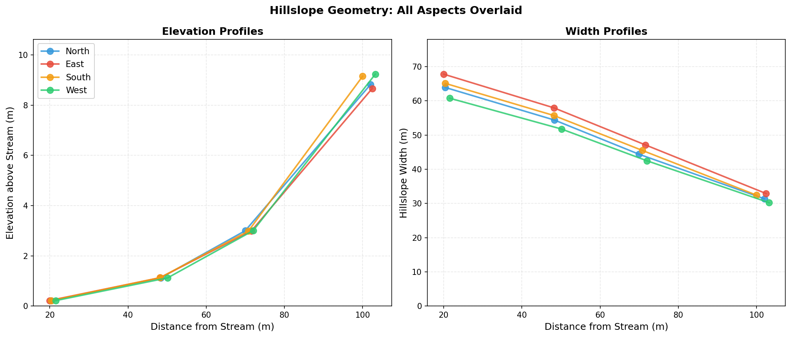
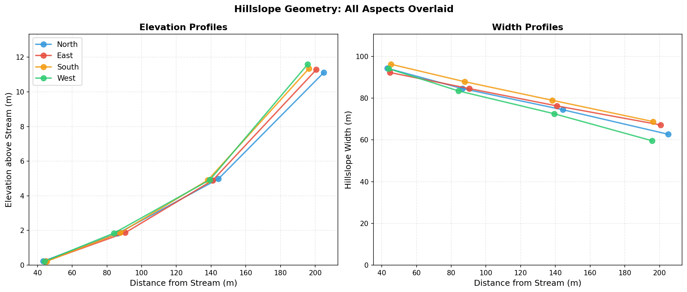
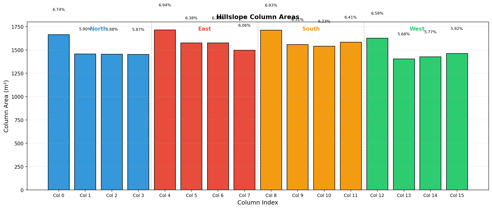
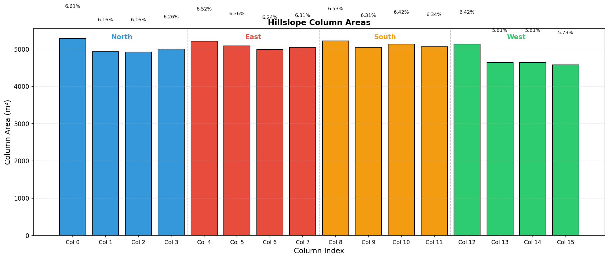

# Dataset Comparison

Comparison of Swenson's global hillslope dataset (90m MERIT DEM) against our OSBS-derived datasets (1m NEON LIDAR).

## Datasets

| Dataset | Source DEM | Resolution | Coverage | File |
|---------|-----------|------------|----------|------|
| Swenson (Global) | MERIT | ~90m | Full OSBS gridcell | `hillslopes_osbs_c240416.nc` |
| Interior (1m) | NEON LIDAR | 1m | 150 interior tiles | `hillslopes_osbs_interior_c260127.nc` |
| Trimmed (1m) | NEON LIDAR | 1m | 39 trimmed-perimeter tiles | `hillslopes_osbs_trimmed-test_c260202.nc` |

## Variable Sources

Our pipeline computes most hillslope parameters directly from the 1m LIDAR DEM, but some variables use placeholder values.

### Computed from DEM

These variables are derived from DEM analysis following Swenson's methodology:

| Variable | Method |
|----------|--------|
| `hillslope_elevation` | Mean HAND (Height Above Nearest Drainage) per elevation bin |
| `hillslope_distance` | Median DTND (Distance To Nearest Drainage) per bin |
| `hillslope_width` | Trapezoidal plan-form fit (Swenson & Lawrence 2025) |
| `hillslope_area` | Fitted trapezoidal areas, not raw pixel counts |
| `hillslope_slope` | Mean topographic slope from DEM gradient |
| `hillslope_aspect` | Circular mean aspect per bin |
| `pct_hillslope` | Relative area fraction per aspect |
| `hillslope_stream_slope` | Derived from lowest-bin slopes × 0.5 |

### Placeholder Values

These variables use hardcoded defaults rather than computed values:

| Variable | Our Value | Swenson (Global) | Notes |
|----------|-----------|------------------|-------|
| `hillslope_bedrock_depth` | 1e6 m | 0.0 m | Placeholder for "effectively infinite" depth |
| `hillslope_stream_depth` | 0.3 m | 0.27 m | Typical small stream estimate |
| `hillslope_stream_width` | 5.0 m | 4.41 m | Typical small stream estimate |

!!! warning "Stream Parameters"
    The stream channel parameters (depth, width) in our files are rough estimates, not computed from the DEM. Swenson's global dataset derived these from hydraulic geometry relationships. For accurate OSBS simulations, these values should be refined using field observations or regional stream data.

### Why Placeholders?

1. **Bedrock depth**: No subsurface data available. The 1e6 m value effectively tells CTSM "no bedrock constraint" on soil column depth.

2. **Stream geometry**: Requires either:
   - Field measurements of bankfull width/depth
   - Regional hydraulic geometry relationships (e.g., Leopold curves)
   - Stream gauge data

   Our pipeline lacks this external data, so we use conservative estimates.

## Parameter Comparison

Values are averaged across all 4 hillslope aspects (N, E, S, W).

| Parameter | Swenson (Global) | Interior (1m) | Trimmed (1m) |
|-----------|------------------|---------------|--------------|
| Elevation range (m) | 0.17 - 8.14 | 0.22 - 9.24 | 0.22 - 11.60 |
| Distance range (m) | 67 - 541 | 20 - 103 | 43 - 205 |
| Mean slope (m/m) | 0.011 | 0.040 | 0.041 |
| Mean width (m) | 539 | 49 | 80 |
| Total area (km²) | 1.19 | 0.025 | 0.080 |

### Key Observations

1. **Distance scales differ dramatically**: The global dataset has hillslope distances 5-25x larger than the LIDAR-derived data. This reflects the coarser stream network delineation from 90m MERIT vs. the fine-scale drainage patterns captured at 1m.

2. **Slopes are steeper in LIDAR data**: Mean slopes are ~3.5x higher in our datasets. The 90m MERIT smooths over local topographic variability, while 1m LIDAR captures actual gradients.

3. **Width scaling follows distance**: Narrower widths in our data are consistent with the shorter hillslope distances.

4. **Elevation ranges are similar**: Despite resolution differences, the elevation relief (~8-12m) is comparable across datasets, which is expected for the same geographic area.

---

## Elevation and Width Profiles

These plots overlay all 4 hillslope aspects (N, E, S, W) showing elevation above stream and width at each topographic position.

### Swenson (Global - 90m MERIT)

### Interior Selection (1m NEON LIDAR)

### Trimmed Selection (1m NEON LIDAR)

---

## Column Area Distribution

Bar charts showing the area distribution across the 16 hillslope columns.

### Swenson (Global - 90m MERIT)

### Interior Selection (1m NEON LIDAR)

### Trimmed Selection (1m NEON LIDAR)

---

## Implications for CTSM Simulations

The differences between global and LIDAR-derived hillslope data have important implications:

1. **Lateral flow dynamics**: Shorter hillslope distances mean faster lateral water redistribution in the 1m datasets.

2. **Water table gradients**: Steeper slopes will drive stronger hydraulic gradients between hillslope elements.

3. **TAI representation**: The finer resolution may better capture the terrestrial-aquatic interface dynamics that are the focus of this research.

4. **Scale consistency**: The 1m LIDAR data represents a single catchment's actual topography, while the global data represents an average over a much larger gridcell.

## Current Status

!!! warning "Known issues affect parameter values"
    The datasets shown above were produced with the pipeline as it existed before the February 2026 audit. Four issues affecting the OSBS pipeline mean the specific parameter values will change when fixes are applied. See [OSBS Implementation — Known Limitations](osbs-implementation.md#known-limitations) for details.

The comparison remains useful for understanding the *scale* of differences between 90m global and 1m site-specific hillslope data — distances are 5-25x shorter, slopes are 3.5x steeper, and the overall relief is comparable. These qualitative patterns will hold regardless of pipeline fixes.

However, the specific numbers (and any CTSM simulations derived from them) should not be treated as final. The path forward:

1. Resolve the four pipeline issues (DTND algorithm, processing resolution, Lc determination, slope/aspect validation)
2. Rerun the pipeline to produce corrected datasets
3. Update this comparison with the corrected values
4. Run branch simulations against the osbs2 baseline to quantify hydrological differences
