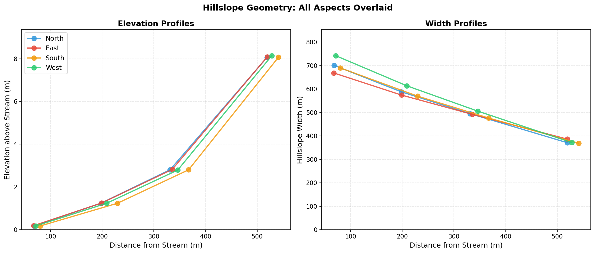
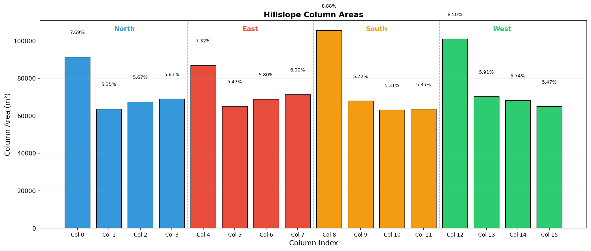

# Dataset Comparison

Comparison of Swenson's global hillslope parameters (90m MERIT DEM) against OSBS-specific parameters derived from 1m NEON LIDAR.

---

## Datasets

| Dataset | Source DEM | Resolution | Coverage | Lc | A_thresh |
|---------|-----------|------------|----------|-----|---------|
| Swenson (Global) | MERIT | ~90m | Full OSBS gridcell | 763 m | 275,400 m^2 |
| OSBS (Current) | NEON LIDAR | 1m | R4C5--R12C14 (90 tiles, 90 km^2) | 356 m | 63,362 m^2 |

The Swenson file (`hillslopes_osbs_c240416.nc`) was extracted from the global 0.9x1.25 deg dataset at the OSBS gridcell. The OSBS file (`hillslopes_osbs_tier3_contiguous_c260317.nc`) was generated by the pipeline described on the [Methodology](osbs-implementation.md) page.

---

## Variable Sources

### Computed from DEM

| Variable | Method |
|----------|--------|
| `hillslope_elevation` | Mean HAND (Height Above Nearest Drainage) per elevation bin |
| `hillslope_distance` | Median DTND (Distance To Nearest Drainage) per bin |
| `hillslope_width` | Trapezoidal plan-form fit (Swenson & Lawrence 2025) |
| `hillslope_area` | Fitted trapezoidal areas, not raw pixel counts |
| `hillslope_slope` | Mean topographic slope from DEM gradient |
| `hillslope_aspect` | Circular mean aspect per bin |
| `pct_hillslope` | Relative area fraction per aspect |
| `hillslope_stream_slope` | Elevation drop along stream network segments |

### Interim and placeholder values

| Variable | OSBS Value | Swenson (Global) | Notes |
|----------|-----------|------------------|-------|
| `hillslope_bedrock_depth` | 0.0 m | 0.0 m | No-op under CTSM Uniform soil profile |
| `hillslope_stream_depth` | 0.141 m | 0.269 m | Interim power law estimate |
| `hillslope_stream_width` | 1.7 m | 4.41 m | Interim power law estimate |
| `hillslope_stream_slope` | 0.00476 m/m | 0.00233 m/m | Computed from DEM stream network |

---

## Parameter Comparison

Values averaged across all 4 aspects. Sources: production `hillslope_params.json` and Swenson NetCDF.

| Parameter | Swenson (Global) | OSBS 1m (Current) |
|-----------|------------------|-------------------|
| Elevation range (m) | 0.17 -- 8.14 | 0.000073 -- 9.55 |
| Distance range (m) | 67 -- 541 | 34 -- 367 |
| Mean slope (m/m) | 0.011 | 0.052 |
| Mean width (m) | 539 | 157 |
| Total area (km^2) | 1.19 | 0.24 |
| Aspect distribution | N: 24.5%, E: 24.6%, S: 25.3%, W: 25.6% | N: 24.7%, E: 24.6%, S: 25.3%, W: 25.4% |

Note about area: Swenson's representative hillslope sums to 1.19 km^2 within a 12,655 km^2 gridcell. The OSBS representative hillslope sums to 0.24 km^2 within a 90 km^2 domain. These are representative hillslopes normalized by `nhillcolumns` and `pct_hillslope` --- not the full domain area.

---

## Key Observations

**1. Distance scales differ by ~1.5--2x.** Swenson distances range 67--541 m; OSBS distances range 34--367 m. This is much closer than previous (pre-fix) runs showed (5--25x difference) because the current pipeline uses hydrological DTND (distance to the drainage-linked stream pixel) rather than EDT (distance to the geographically nearest stream pixel). The remaining 1.5--2x difference reflects the denser stream network from higher-resolution data: Lc = 356 m at 1m vs Lc = 763 m at 90m, producing more stream pixels per unit area.

**2. Slopes ~4.7x higher.** Mean slope 0.052 m/m vs 0.011 m/m. Full 1m resolution captures local topographic variability that 90m MERIT averages away. This is expected --- slope is the most resolution-sensitive of the six parameters (Phase B confirmed systematic underestimation at coarser resolution, ~50% reduction at 4m vs 1m in the lowest HAND bin).

**3. Width scaling follows distance.** Mean width 157 m vs 539 m (~3.4x reduction). Width is derived from the trapezoidal fit on accumulated area vs distance, so shorter hillslopes produce narrower widths.

**4. Elevation ranges comparable.** Swenson 0.17--8.14 m, OSBS 0.000073--9.55 m. Same geographic area produces similar total relief (~8--10 m from outlet to ridge). The near-zero lowest bin in OSBS (HAND bin boundary at 0.00027 m) reflects the equal-area binning algorithm on flat terrain --- 25% of pixels in each aspect have HAND below 0.00027 m because much of the site is at stream level. This is correct behavior, not a bug.

**5. Aspect distribution symmetric.** Both datasets show ~25% per direction, consistent with expectations for gently rolling terrain without a dominant orientation.

---

## Elevation and Width Profiles

### Swenson (Global -- 90m MERIT)

### OSBS (Current -- 1m NEON LIDAR)

<!-- TODO: Generate elevation/width profile plots from production data -->
*Elevation and width profile plots for the current production data will be added here.*

The plots will show overlaid profiles for all 4 aspects: elevation above stream (left panel) and hillslope width (right panel) vs distance from stream (x-axis).

---

## Column Area Distribution

### Swenson (Global -- 90m MERIT)

### OSBS (Current -- 1m NEON LIDAR)

<!-- TODO: Generate column area distribution plots from production data -->
*Column area distribution plots for the current production data will be added here.*

Expected pattern: bar charts showing area per column, grouped by aspect. Expect relatively uniform distribution across bins and aspects for the flat OSBS terrain, in contrast to Swenson's global data where the lowest bin captures disproportionately more area.

---

## Implications for CTSM Simulations

**1. Lateral flow dynamics.** Shorter hillslope distances (34--367 m vs 67--541 m) mean faster lateral water redistribution between columns. The ~1.5x shorter flow paths will produce faster response times in the lateral subsurface flow calculation (Darcy's Law, `SoilHydrologyMod.F90`).

**2. Hydraulic gradients.** Steeper slopes (0.052 vs 0.011 m/m) drive stronger hydraulic gradients between hillslope elements. Combined with shorter distances, this will accelerate drainage from ridge to outlet columns.

**3. TAI representation.** The finer stream network (0.23% coverage at 1m vs the global dataset) captures smaller drainage channels that may be important for wetland-upland transitions at OSBS. Whether the additional stream detail improves TAI dynamics in CTSM depends on how the lateral flow parameterization responds to the different hillslope geometry.

**4. Column weighting.** The more uniform area distribution across OSBS bins means column weights are more evenly distributed in gridcell-mean output. In CTSM, `wtgcell = (hill_area / hillslope_area) * (pct_hillslope / 100)` --- uniform areas mean no single column dominates the weighted average. This contrasts with Swenson's data where the lowest bin captures disproportionately more area.

These are qualitative predictions. Phase F will run CTSM simulations comparing the two datasets to quantify differences in water table depth, soil moisture, and carbon fluxes.
