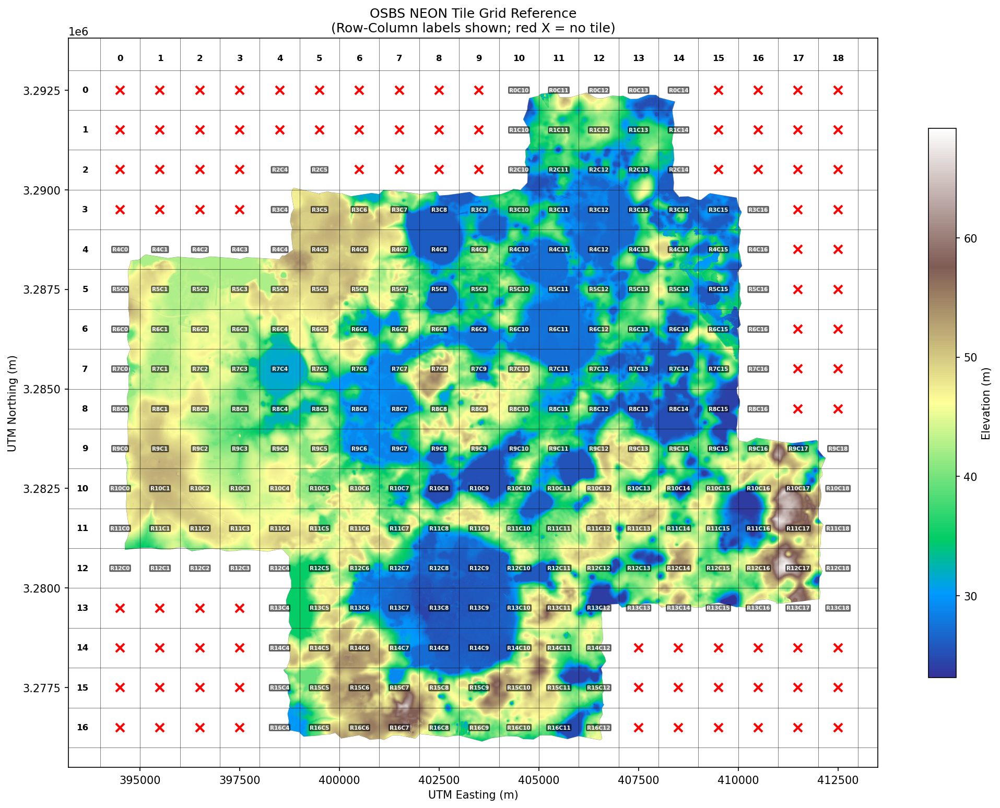

# Methodology

*Representative hillslope parameters for OSBS from 1m NEON LIDAR following Swenson & Lawrence (2025).*

---

This page describes the methods used to produce the hillslope parameter file for OSBS. The methodology follows Swenson & Lawrence (2025) with adaptations for UTM CRS and 1m resolution. The pipeline was validated against Swenson's published data (see [MERIT Validation](merit-validation.md)) and verified through three independent audits: equation verification, full pipeline audit, and line-by-line divergence audit against Swenson's original code.

---

## Study Domain and Data

### NEON LIDAR

| Property | Value |
|----------|-------|
| Dataset | NEON DP3.30024.001 (Elevation - LiDAR) |
| Site | OSBS (Ordway-Swisher Biological Station) |
| Collection | 2023-05 |
| Files | 233 DTM tiles |
| Resolution | 1.0 m |
| CRS | EPSG:32617 (UTM Zone 17N) |
| Tile size | 1000 x 1000 pixels (1 km^2) |

### Production Domain

The production domain is R4C5--R12C14: a 9x10 km (90 km^2) rectangle of 90 tiles with 0% nodata --- the largest contiguous rectangle within the NEON tile coverage. This domain was selected to avoid the nodata gaps present in the full tile mosaic (233 tiles, 323 km^2, 58.5% valid data), which cause silent failures in pysheds flow routing when all domain boundary cells are nodata.

DEM elevation ranges from 23 to 69 m with ~46 m total relief. The low total relief confirms this is a low-relief wetlandscape where meter-scale elevation differences control wetland-upland transitions.

### Tile Reference System

- **Format:** `R{row}C{col}` (e.g., R5C7)
- **Grid dimensions:** 17 rows x 19 columns (233 of 323 possible positions occupied)
- **Coordinate mapping:** Easting = 394000 + col * 1000; Northing = 3292000 - row * 1000
- **KML export** available for Google Earth overlay

---

## Characteristic Length Scale (Lc)

The characteristic length scale Lc determines the accumulation threshold A_thresh = 0.5 * Lc^2 (Swenson Eq. 6), which controls stream network density. All downstream parameters --- HAND, DTND, catchment delineation, and all six hillslope parameters --- depend on it.

### Standard method

Swenson's approach applies the Laplacian operator to the DEM, computes the 2D Fourier transform, bins the spectrum radially, and fits Gaussian/lognormal models to identify the wavelength of peak amplitude. This works at 90m MERIT resolution because features below ~180m (the Nyquist limit) are already averaged away, leaving a single dominant drainage-scale peak. On MERIT, this produces Lc = 763 m.

### The k^2 artifact at 1m

At 1m resolution, the standard method identifies a peak at 8.1 m. This is not the drainage scale --- it is a spectral artifact. The Laplacian operator weights the spectrum by k^2, amplifying short-wavelength features relative to longer ones. The raw DEM spectrum (without the Laplacian) is monotonically increasing red noise with no peaked feature at any scale. The k^2 weighting amplifies micro-topographic features (tree-throw mounds, animal burrows, shallow rills) that are invisible at 90m by orders of magnitude relative to the drainage-scale features at 200--500 m. At 1m, the raw 8 m amplitude is ~620x weaker than the 200--500 m amplitude, but the k^2 factor (300/8)^2 ~ 1400x inverts their relative prominence in the Laplacian spectrum.

Physical implausibility confirms the artifact interpretation: A_thresh = 0.5 * 8^2 = 32 m^2 would classify 20--40% of all pixels as stream --- not a meaningful drainage network.

### Solution: restricted-wavelength FFT

Excluding wavelengths below 20 m before peak fitting reveals the drainage-scale peak. The 20 m cutoff separates micro-topography from organized drainage structure, analogous to what 90m resolution does implicitly by averaging away sub-180 m features.

Restricted-wavelength sweep on the contiguous production mosaic (9000 x 10000 pixels, 0% nodata):

| Min wavelength | Lc (m) | Model | Interpretation |
|----------------|--------|-------|----------------|
| None (full) | 8.1 | lognormal | Micro-topographic artifact |
| 10 m | 11.7 | lognormal | Still dominated by micro-topography |
| 20 m | 356 | lognormal | Drainage-scale peak emerges |
| 50 m | 356 | lognormal | Stable |
| 100 m | 285 | gaussian | Stable (different model, same feature) |
| 180 m | 229 | linear (no peak) | Too few bins below peak |

The transition at 20 m is sharp --- the drainage-scale peak jumps from invisible to dominant when micro-topographic wavelengths are excluded. The 285--356 m range from different cutoffs and models represents uncertainty in the exact Lc value.

### Result

**Lc = 356 m** (lognormal fit at 20 m cutoff), **A_thresh = 63,362 pixels** at 1m resolution.

### Physical validation

Two consistency checks from Swenson Section 2.4:

- **P95 DTND / Lc = 1.17.** Swenson's criterion: the largest values of DTND should be "of similar magnitude" to Lc. P95 is the appropriate comparison statistic at 1m (see below). **PASS.**
- **Mean catchment area / Lc^2 = 0.876.** Swenson's calibration: 0.94 for low-relief terrain. Close agreement. **PASS.**

Note on `max(DTND)`: the raw maximum DTND/Lc ratio is 3.1, but `max()` is not comparable between 90m MERIT (~12K pixels per gridcell) and 1m OSBS (25M pixels). At 90m, each pixel averages a 90x90 m area, blunting ridge extremes; at 1m, individual ridgeline pixels are preserved. The 2000x sample size difference shifts the extreme value distribution rightward. P95 is the resolution-fair comparison.

### Sensitivity

Lc is insensitive to all FFT parameters. A sweep of 20 configurations (blend_edges, zero_edges, NLAMBDA, MAX_HILLSLOPE_LENGTH, detrend) produced Lc variation of only 1.7 m. The spectral peak is strong enough (psharp 9--12) that preprocessing choices do not affect the result.

---

## Stream Network Delineation

### Accumulation threshold

A_thresh = 0.5 * 356^2 = 63,362 pixels at 1m resolution. This is the same order of magnitude as MERIT (275,400 m^2 at 90m), scaled for the finer drainage structure visible at 1m.

### DEM conditioning

The DEM is conditioned through pysheds' standard sequence: fill_pits, fill_depressions, resolve_flats (with fallback to conditioned DEM if resolve_flats fails on the full domain), D8 flow direction, and flow accumulation. Pixels exceeding A_thresh are classified as stream.

### Connected-component extraction and edge trimming

Two preprocessing steps are required for mosaicked NEON data that are not needed for continuous MERIT tiles. First, `scipy.ndimage.label` isolates the largest contiguous data region from the mosaic. Second, all-nodata rows and columns are trimmed from the bounding box. Both steps address a fundamental constraint of D8 flow routing: pysheds requires flow to exit the domain at boundary cells. When all boundary cells are nodata, no cell can accumulate flow from others --- max_accumulation silently equals 1 with no error raised.

### Stream network results

| Metric | Value |
|--------|-------|
| Stream cells | 207,832 (0.23% of domain) |
| Network length | 256,519 m |
| Network slope | 0.004755 m/m |

### Known limitation: depression filling

DEM conditioning fills all depressions, which at 1m resolution erases real geomorphic features --- sinkholes, wetland depressions, karst dissolution features --- that are central to OSBS hydrology. Standard D8 flow routing requires a depression-free DEM. Alternative approaches (priority-flood with depression retention, depression-aware routing) exist but would require a different hydrological framework. This is a fundamental limitation of applying Swenson's D8-based methodology to high-resolution data in a landscape where closed basins are common.

---

## Hillslope Parameter Computation

### HAND and DTND

Computed by pysheds `compute_hand()`, which traces each pixel's D8 flow path to its drainage stream pixel and returns the elevation difference (HAND) and horizontal distance (DTND). This produces hydrologically-linked values --- each pixel's distance is to the stream pixel it actually drains to, not to the geographically nearest stream pixel. The UTM-aware fork (Phase A) uses Euclidean distance for projected CRS rather than haversine.

HAND range: 0--25.1 m, median 1.6 m. The low median reflects the flat terrain --- over half the domain is within 1.6 m of its nearest stream.

### Slope and aspect

Computed from the original DEM (not the pysheds-conditioned DEM) using pgrid's Horn (1981) 8-neighbor stencil. The conditioned DEM replaces nodata values with max_elevation + 1 to prevent flow through gaps, creating massive false gradients at every nodata boundary. The original DEM preserves nodata as NaN, which propagates correctly through the gradient computation, preventing false gradients at boundaries.

The Horn stencil uses the UTM-aware code path (Phase A) with uniform pixel spacing from the affine transform rather than haversine-based variable spacing. This produces correct slope and aspect values on projected coordinates.

### Catchment-level aspect averaging

Before aspect binning, per-pixel aspects are replaced with the circular mean aspect of each catchment side (left bank, right bank, headwater). Swenson's code performs this step (`set_aspect_to_hillslope_mean_serial`, `Representative_Hillslopes/terrain_utils.py`) before the binning loop. This stabilizes bin assignments for pixels near aspect boundaries, where small HAND differences can push the per-aspect Q25 statistic across the mandatory 2 m bin threshold. This was the single largest improvement found during the MERIT validation audit (+0.08 to area fraction correlation, from 0.83 to 0.90).

### Aspect binning

4 bins following Swenson Table 1:

| Bin | Range | Label |
|-----|-------|-------|
| 1 | 315 deg -- 45 deg | North |
| 2 | 45 deg -- 135 deg | East |
| 3 | 135 deg -- 225 deg | South |
| 4 | 225 deg -- 315 deg | West |

### HAND binning

4 elevation bins with approximately equal pixel counts per aspect. The paper mandates that the upper bound of the lowest bin be <= 2 m, ensuring the soil column extends below stream channel elevation for two-way water exchange between stream and groundwater. The bin computation follows Swenson's `SpecifyHandBounds()` algorithm.

Production bin boundaries: [0.0, 0.00027, 1.61, 5.29, 25.1] m. The near-zero lowest boundary (Q25 = 0.00027 m) reflects equal-area binning on flat terrain --- 25% of pixels in each aspect have HAND below 0.00027 m because a large fraction of this low-relief site is at stream level.

### DTND tail removal

An exponential fit to the DTND distribution identifies and removes long-distance outliers before parameter computation. Applied per-catchment-side. This prevents a few pixels with anomalously long flow paths (e.g., single ridgeline pixels) from distorting the trapezoidal width fit.

### Trapezoidal width fitting (Swenson Eq. 9--16)

For each aspect bin, area is accumulated as a function of distance from stream: A_sum(d). The paper models hillslope plan form as a trapezoid: w(d) = w_base + 2*alpha*d, where w_base is the width at the stream channel and alpha is the plan form divergence parameter. The cumulative area curve A_sum(d) is fit with a degree-2 polynomial whose coefficients yield the trapezoidal parameters (Eq. 12, 14): alpha = -a_2, w_base = -a_1.

Width for each HAND bin is computed from the quadratic solver on fitted trapezoidal areas (not raw pixel counts): the accumulated fitted area at each bin's lower distance boundary is solved via Eq. 16 (A = alpha * d^2 + w_base * d), and the width evaluated from the trapezoidal model at that distance (Eq. 9). This two-pass approach (first collect raw areas, then compute widths from fitted areas) ensures width varies monotonically from outlet to ridge and matches Swenson's implementation.

---

## Processing Resolution

Full 1m resolution, no subsampling. The production domain (90M pixels) processes in 22.6 minutes at ~29 GB peak memory on a single HPC node with 64 GB allocation.

Earlier work subsampled to 4m after an OOM failure at 64 GB. Phase B testing demonstrated this was unnecessary: the OOM occurred on a nodata-contaminated mosaic (189M pixels, 37.5% nodata) where tile gap fill created artificial flat regions that inflated `resolve_flats` memory. The contiguous production domain (90M pixels, 0% nodata) completes at 29 GB peak.

Resolution comparison across 1m, 2m, and 4m on both a 5x5 tile block (25M pixels) and the full 90-tile domain:

- **Height and distance:** >0.999 correlation across all resolutions (resolution-insensitive). These are the parameters that drive lateral flow in CTSM.
- **Slope:** Systematically underestimated at coarser resolution (~50% lower at 4m in the lowest HAND bin). This is a smoothing artifact --- coarser pixels average away local gradients.
- **Area and aspect:** 0.64--0.99 correlations. More catchments (larger domain) produce more stable statistics.

No parameter improves with coarser resolution. Computational cost at 1m is not a barrier (17 min wall time, 58 GB peak for the full domain).

---

## Adaptations from Swenson

| Category | What | Why |
|----------|------|-----|
| **Kept identical** | Trapezoidal width model (Eq. 9--16), HAND binning algorithm, quadratic solver, 2 m lowest-bin constraint, circular mean aspect, DEM conditioning chain (fill pits, fill depressions, resolve flats, D8, accumulation) | Core methodology validated against Swenson's published data. MERIT validation: 5 of 6 parameters >0.98 correlation, area fraction 0.92. |
| **CRS adaptation** | Euclidean DTND in `compute_hand()` (vs haversine), Horn 1981 stencil with uniform pixel spacing in `_gradient_horn_1981()` (vs haversine + cos(lat) spacing), planar arctan2 for AZND (vs spherical bearing), Euclidean segment length in `river_network_length_and_slope()` | UTM coordinates are in meters. Haversine formulas applied to UTM easting/northing produce incorrect distances (treating 404000 m as 404000 deg). All CRS-dependent functions detect the grid's CRS automatically via `_crs_is_geographic()` and branch appropriately. |
| **Resolution adaptation** | Restricted-wavelength FFT with min_wavelength=20 m (vs direct peak from full spectrum), blend_edges=50 px (vs 4 px), full 1m processing (vs direct ~90m) | 1m data contains micro-topographic noise invisible at 90m. The Laplacian k^2 weighting creates an artifact peak at 8 m. Excluding wavelengths <20 m exposes the drainage-scale peak at 285--356 m. Larger edge blending windows compensate for the different geographic footprint per pixel. |
| **Improved during validation** | Catchment-level aspect averaging before binning, binary basin mask (vs DEM-difference threshold), corrected n_hillslopes indexing (extract drainage_id to gridcell before indexing), DTND tail removal (exponential fit), polynomial fit weighting matching Swenson's normal equations | Found and fixed during systematic line-by-line audit of the MERIT validation pipeline against Swenson's original code. Collectively improved area fraction correlation from 0.82 to 0.92. |
| **Known limitations** | Stream depth (0.141 m) and width (1.7 m) from interim power law, bedrock depth set to 0, depression filling erases real closed basins | Phase E: stream parameters require field data or regional empirical relationships. Bedrock depth of 0 is a no-op under CTSM's Uniform soil profile method. Depression filling is inherent to D8 routing. |

---

## Output Format

The pipeline outputs a CTSM-compatible NetCDF file containing all required hillslope variables.

### Dimensions

| Dimension | Size | Description |
|-----------|------|-------------|
| `lsmlat` | 1 | Single gridcell latitude |
| `lsmlon` | 1 | Single gridcell longitude |
| `nhillslope` | 4 | Aspect bins (N, E, S, W) |
| `nmaxhillcol` | 16 | Total hillslope columns |

### Key variables

| Variable | Units | Description |
|----------|-------|-------------|
| `nhillcolumns` | -- | Number of hillslope columns (16) |
| `pct_hillslope` | % | Area fraction per aspect |
| `hillslope_elevation` | m | Height above stream (HAND) |
| `hillslope_distance` | m | Distance from stream (DTND) |
| `hillslope_width` | m | Hillslope width at downslope edge |
| `hillslope_area` | m^2 | Hillslope element area |
| `hillslope_slope` | m/m | Topographic slope |
| `hillslope_aspect` | radians | Azimuthal orientation (0--2pi, clockwise from N) |
| `hillslope_bedrock_depth` | m | Bedrock depth (0 = use CTSM default) |
| `hillslope_stream_depth` | m | Stream bankfull depth |
| `hillslope_stream_width` | m | Stream bankfull width |
| `hillslope_stream_slope` | m/m | Stream channel slope |

Production output: `hillslopes_osbs_tier3_contiguous_c260317.nc`. 16 columns (4 aspects x 4 HAND bins). NetCDF structure verified against Swenson reference (`hillslopes_osbs_c240416.nc`) --- all 4 dimensions match, all 20 variables present with identical names, dtypes, and units.

Conversions applied: aspect from degrees to radians, longitude to 0--360 deg convention for CTSM.

---

## Current Limitations and Remaining Work

**Stream channel parameters** are interim estimates derived from power-law relationships applied to the computed stream network: depth 0.141 m, width 1.7 m, slope 0.00476 m/m. For comparison, Swenson's global values for this gridcell are: depth 0.269 m, width 4.41 m, slope 0.00233 m/m. The interim values are in the right order of magnitude but lack a rigorous basis. Phase E will derive these from field data or regional empirical relationships (e.g., Leopold curves, MERIT Hydro).

**Bedrock depth** is set to 0. Under CTSM's Uniform soil profile method (used by the osbs2 reference case), a bedrock depth of 0 tells CTSM to use its default soil profile --- it is a no-op. The Swenson reference file also has all zeros. If a non-Uniform soil profile method is used in the future, this parameter would need physical values from subsurface data.

**DEM conditioning erases real closed basins.** At 1m resolution, pits and depressions include real features: sinkholes, wetland depressions, karst dissolution features. Filling them enforces a continuous drainage network but destroys information about closed basins that are central to OSBS hydrology. This is inherent to D8 flow routing and is the same approach Swenson uses at 90m (where these features are already below the resolution). Alternative approaches (depression-aware routing, synthetic lake bottoms) would require a different hydrological framework and are beyond the scope of the current implementation.

**Hillslope structure** is 4 aspects x 4 HAND bins (16 columns), matching the Swenson default. An alternative configuration of 1 aspect x 8 HAND bins may better represent this nearly-flat site, where aspect-dependent insolation has negligible physical impact (slopes 0.01--0.06 m/m produce a maximum 6% correction to solar incidence angle). More elevation bins would provide finer resolution of the water table gradient across the hillslope profile. CTSM supports arbitrary configurations --- it reads `nhillslope` and `nmaxhillcol` from the input file. This decision is under consideration (STATUS.md, open question #2).

**No CTSM simulation comparison yet.** Phase F will create a branch case from the osbs2 baseline (year 861) with the custom hillslope file and compare outputs (water table depth, soil moisture, carbon fluxes) against the baseline.
